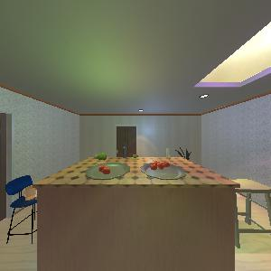
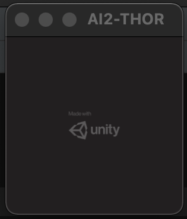
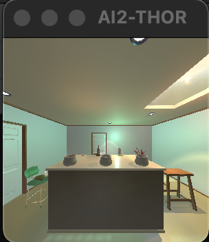

# Simulated Cognitive Experiment Test Suite

There are several established collections of cognition tests used to test aspects of intelligence in animals (e.g. crows, monkeys) and humans such as the [Primate Cognition Test Battery](https://journals.plos.org/plosone/article?id=10.1371/journal.pone.0032024). These experiments help determine, for example, an agent's ability to understand object permanence and causality. Although these experiments are very common in cognitive science, they have not been deployed on and applied to machine learning models and algorithms. This is mostly because, so far, these cognitive science experiments were undertaken manually, with an experimenter having to physically move objects in from of the test agent while recording the interaction as a data point. 

The goal of the Simulated Cognitive Experiment Test Suite is to allow these experiments to be deployed for machine learning research, and at scale. We therefore recreate these experiments in 3D in a randomized and programmatic fashion to allow for the creation of rich, large datasets. 

This repository contains the implementation of these experiments built using [AI2-THOR](https://github.com/allenai/ai2thor) and Unity 3D.


## 🤖️ Implemented simulations:

Before attempting to reproduce these simulations, ensure that you have completed [basic setup](#💻-installation).


### Gravity Bias
This experiment tests an agent's ability to recognize the role gravity plays in objects' movements. A number of rewards is dropped through an opaque tube into one of three receptables, and the agent has to infer in which receptable the reward lands.

Unlike some other experiments, this experiment was built using Unity3D instead of AI2-THOR. To set up the experiment, you need to:
- Download the Gravity Bias Unity build from the following link [here](https://www.dropbox.com/s/5wdirl50wcwh1dr/GravityBias.zip).
- Unzip the GravityBias.zip file in the `cognitive_battery_benchmark/experiments/dataset_generation/utils` folder.

```angular2html
cd experiments/dataset_generation
python gravity_bias_example.py
```

https://user-images.githubusercontent.com/45083797/151129645-a284595b-16fc-4aa8-9142-66918c56dc3b.mp4


### Shape causality
In this experiment, the agent has to infer that the reward is under the object that is raised over the table as it is hiding a reward underneath. The idea is to infer a causal relationship between shape and reward position.

```angular2html
cd experiments/dataset_generation
python shape_example.py
```


https://user-images.githubusercontent.com/1942909/152035291-598a939a-e95c-4013-91f4-5f5f5aabbc81.mp4


### Addition numbers
In this experiment, the agent has to infer which plate (left or right) contains the higher number of reward that were transfered from the center plate.

```angular2html
cd experiments/dataset_generation
python addition_numbers_example.py
```


https://user-images.githubusercontent.com/1942909/152035368-e0843b69-684f-4a45-bf33-cb58307b0d23.mp4


### Relative numbers
This is the simplest experiment whereby the agent has to decide which plate has more rewards.



```angular2html
cd experiments/dataset_generation
python relative_numbers_example.py
```

### Simple swap
This is based on the famous shell game where a reward is put in/under one bowl, and the bowl is swapped around. The agent has to infer based on the motion of the bowls which bowl did the rewards end up in.

```angular2html
cd experiments/dataset_generation
python simple_swap_example.py
```


https://user-images.githubusercontent.com/1942909/152035221-c4f68359-cffa-4064-b885-2dc2af0f5dc9.mp4


### Rotation
In this experiment, similar to the simple swap experiment, the agent has to where the reward ends up. Instead of swaps, the receptables are moved using rotations.

```angular2html
cd experiments/dataset_generation
python rotation_example.py
```


https://user-images.githubusercontent.com/1942909/152035396-739de83b-bdb7-4744-a45c-6de23a653439.mp4


## 💻 Installation


### Clone this repo
```python
git clone https://github.com/d-val/cognitive_battery_benchmark
```

- Download our customized build from the following link [here](https://www.dropbox.com/s/dd0goyeihrwaxe6/thor-OSXIntel64-local.zip?dl=0)
- Unzip the downloaded thor-OSXIntel64-local.zip file in the `cognitive_battery_benchmark/experiments/dataset_generation/utils` folder

### Python 3.7 or 3.8 set-up:

Select one of the below installation options (pip *or* conda).

#### With pip:

```bash
pip install -r setup/requirements.txt
```

#### With conda:

```bash
conda env create -f setup/environment.yml
conda activate cognitive-battery-benchmark
```

## 🕹️ Running simulation
### Minimal Example to test if AI2-THOR installation:

Most of our simulated environments are built on top of the excellent [AI2-THOR](https://github.com/allenai/ai2thor) interactable framework for embodied AI agents.
After running `pip` or `conda` install earlier, it should have installed AI2-THOR. you can verify that everything is working correctly by running the following minimal example:

```python
python ai2-thor-minimal-example.py
```

This will download some AI2-THOR Unity3D libraries which can take a while as they are big (~0.5 GB)

```angular2html
ai2thor/controller.py:1132: UserWarning: Build for the most recent commit: 47bafe1ca0e8012d29befc11c2639584f8f10d52 is not available.  Using commit build 5c1b4d6c3121d17161935a36baaf0b8ac00378e7
  warnings.warn(thor-OSXIntel64-5c1b4d6c3121d17161935a36baaf0b8ac00378e7.zip: [|||||||||||||||||||||||||||||||||||||||                                                        42%   1.7 MiB/s]  of 521.MB
```
After this downloads, you will see a Unity simulator window open up:



Followed by this terminal output:

```angular2html
success! <ai2thor.server.Event at 0x7fadd0b87250
    .metadata["lastAction"] = RotateRight
    .metadata["lastActionSuccess"] = True
    .metadata["errorMessage"] = "
    .metadata["actionReturn"] = None
> dict_keys(['objects', 'isSceneAtRest', 'agent', 'heldObjectPose', 'arm', 'fov', 'cameraPosition', 'cameraOrthSize', 'thirdPartyCameras', 'collided', 'collidedObjects', 'inventoryObjects', 'sceneName', 'lastAction', 'errorMessage', 'errorCode', 'lastActionSuccess', 'screenWidth', 'screenHeight', 'agentId', 'colors', 'colorBounds', 'flatSurfacesOnGrid', 'distances', 'normals', 'isOpenableGrid', 'segmentedObjectIds', 'objectIdsInBox', 'actionIntReturn', 'actionFloatReturn', 'actionStringsReturn', 'actionFloatsReturn', 'actionVector3sReturn', 'visibleRange', 'currentTime', 'sceneBounds', 'updateCount', 'fixedUpdateCount', 'actionReturn'])
```


### Running Human Cognitive Battery Experiments
To run [the experiments described above](#🤖️-implemented-simulations), paste the code snippet into the terminal.

For instance, for the `SimpleSwap` example, run the code below:
```
cd experiments/dataset_generation
python simple_swap_example.py
```

If successful, a window will pop up, and the experiment will run in the terminal. The output for the `SimpleSwap` example is shown below:



## 💾 Saving Images

To save images of a simulation, ensure that the last line is uncommented. (By default, the last line is uncommented. For instance, `SimpleSwapExperiment.save_frames_to_folder('output')` in `experiments/dataset_generation/simple_swap_example.py` is uncommented.)

This will save the experiment inside of `experiments/dataset_generation/output` as a `human_readable/` set of frames with accompanying target/label (in the swap experiment, this is the zero-indexed index of the correct pot where the reward ended in), a `machine_readable/` pickle file containing all frames and metadata, and a video `experiment_video.mp4`.

## 📝 Technical definitions and implementation summary:
Each of the simulated experiments are instances of the `Experiment` class saved within the 'experiments/dataset_generation/utils/experiment.py' class definition.

To run all experiments as a job,

```
cd experiments/dataset_generation
python run_all_experiments.py
```

If all goes well, this will output:
```angular2html
Running Experiment: AdditionNumbers | 1 Iterations
100%||█████████████████████████| 1/1 [00:30<00:00, 30.95s/it]
Running Experiment: RelativeNumbers | 1 Iterations
100%||█████████████████████████| 1/1 [00:04<00:00,  4.01s/it]
Running Experiment: Rotation | 1 Iterations
100%||█████████████████████████| 1/1 [00:06<00:00,  6.34s/it]
Running Experiment: Shape | 1 Iterations
100%||█████████████████████████| 1/1 [00:09<00:00,  9.99s/it]
Running Experiment: SimpleSwap | 1 Iterations
100%||█████████████████████████| 1/1 [00:12<00:00, 12.46s/it]
Running Experiment: GravityBias | 1 Iterations
100%|████████████████████████████████████████████████████████| 1/1 [00:22<00:00, 22.57s/it]

```

The created datasets will be stored in `cd experiments/dataset_generation/output`

Here is a [link](https://www.dropbox.com/s/olexofguy109jli/2022-01-31_15_28_40_429894.zip?dl=0) to a zipped folder as an example of the expected output. 


## 🚨 Issues & Debugging
- When running on OS X, you might get a prompt that `thor-OSXIntel64-local` is not verified. Follow the following [steps](https://support.apple.com/guide/mac-help/open-a-mac-app-from-an-unidentified-developer-mh40616/mac) for allowing running of the file.

## 🏗️ Repository Structure (in progress)
<!-- 
The structure of the `cognitive_battery_benchmark` folder is as follows:

- **experiments**: files necessary to run experiments, based on reference paper
  - `addition_numbers.py`: addition numbers test class
  - `experiment.py`: base experiment class
  - [**not working**] `object_permanence.py`: object permanence test class
  - [**not working**] `relative_numbers.py`: relative numbers test class
  - `rotation.py`: rotation swap test class
  - `simple_swap.py`: simple swap test class
  - `gravity_bias.py`: gravity bias test class
  - **utils**: helper files for experiments
    - `util.py`: helper functions
    - `video_controller.py`: basic implementation for a video controller for AI2THOR  
  - **frames**: folder to store frames of experiments
- **setup**: helper files for setting up the module
  - `environment.yml`: setup conda installation
  - `requirements.txt`: setup pip installation -->

